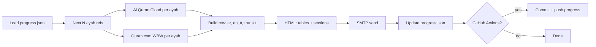

# Quran daily email (free, no n8n)

Sends **20 ayahs** per run: **word table** = Arabic + Latin + **English gloss** + **Turkish gloss** (Quran.com), plus **heuristic “Okuma & dilbilgisi”** reminders (tecvid/nahiv hints — verify with a teacher). Full ayah **English** + **Turkish (Diyanet)**. Not scholar **iʿrāb** or **tafsir**.

Progress is stored in `data/progress.json`.

## Quick setup (Windows)

In PowerShell, from this folder:

```powershell
Set-ExecutionPolicy -Scope CurrentUser RemoteSigned
.\setup_all.ps1
```

That runs `pip install`, creates `.env` if missing, and registers the daily **10:30** task. Then put your **`SMTP_PASSWORD`** in `.env` and test with `python send_daily_quran.py`.

From [python.org](https://www.python.org/downloads/) — check “Add python to PATH”.

## 2. Install dependencies

Open PowerShell or Command Prompt in this folder:

```bat
python -m pip install -r requirements.txt
```

## 3. Configure email

1. Copy `config.example.env` to **`.env`** in this same folder.
2. Fill in **SMTP_HOST**, **SMTP_PORT** (usually `587`), **SMTP_USER**, **SMTP_PASSWORD**, **MAIL_FROM**, **MAIL_TO**.

Outlook often blocks plain SMTP; if login fails, use **Gmail + App Password** or **SendGrid** SMTP and set `MAIL_FROM` / `MAIL_TO` as needed.

## 4. Test manually

```bat
python send_daily_quran.py
```

Or double-click `run_once.bat`.

## 5. Schedule 10:30 Eastern

**Easiest:** Set Windows clock timezone to **Eastern**, then run (PowerShell):

```powershell
Set-ExecutionPolicy -Scope CurrentUser RemoteSigned
cd C:\Users\rober\quran-daily-free
.\register_scheduled_task.ps1
```

The task runs at **10:30** in whatever timezone the PC uses. For Eastern all year, keep Windows on **(UTC‑05:00) Eastern Time** with automatic DST.

**Remove the task:**

```powershell
Unregister-ScheduledTask -TaskName QuranDailyStudyEmail -Confirm:$false
```

## Reset progress

Delete `data\progress.json` (or edit `surah` / `ayah` inside it). Next run starts from **2:1** again.

## GitHub Actions (no PC on — free tier)

Workflow: [`.github/workflows/daily-quran-email.yml`](.github/workflows/daily-quran-email.yml). It runs **daily on GitHub’s clock (UTC)** and can be triggered manually under **Actions → Daily Quran email → Run workflow**.

1. Push this folder as a GitHub repository ( **`data/progress.json` is tracked** so the next ayah is remembered between runs).
2. **Settings → Secrets and variables → Actions → New repository secret** — add the same values you use in `.env`:

   | Secret | Notes |
   |--------|--------|
   | `SMTP_HOST` | e.g. `smtp.gmail.com` |
   | `SMTP_PORT` | e.g. `587` |
   | `SMTP_USER` | SMTP login |
   | `SMTP_PASSWORD` | App password / SMTP secret |
   | `MAIL_FROM` | From address |
   | `MAIL_TO` | Your inbox |

   Optional (same as local `.env`): `OPENAI_API_KEY`, `OPENAI_MODEL`, `OPENAI_GUIDANCE`, `CHUNK_SIZE`.

3. **Cron is UTC**, not Eastern. The workflow comment shows `30 15 * * *` (≈ 10:30 **EST**); for **EDT** you may prefer `30 14 * * *`. Use [crontab.guru](https://crontab.guru) to adjust.
4. **Turn off the Windows scheduled task** if you use Actions only, or you may get **two emails** and conflicting progress:

   ```powershell
   Unregister-ScheduledTask -TaskName QuranDailyStudyEmail -Confirm:$false
   ```

After the first successful run, Actions commits an updated `data/progress.json`. If **branch protection** blocks the bot from pushing, allow **GitHub Actions** write access or push from a fork/bot rule in repo settings.

---

## How this was built (read this to understand the system)

This section explains the **architecture**, **tools**, and **design choices** so you can read the code with context.

### What problem it solves

You want a **repeatable daily study email** that includes, for each ayah in order (from **Al-Baqarah 2:1** through **An-Nas**):

- **Uthmani** Arabic text  
- A **Latin transliteration** line (from the Quran API bundle)  
- **Word-by-word** rows: Arabic, Latin, **English gloss**, **Turkish gloss** (from Quran.com’s API)  
- Light **reading / nahw hints** (heuristics, not full iʿrâb)  
- Full-ayah **English** + **Turkish (Diyanet)** translations  
- Optional **deeper grammar** (pattern matching + merged word tips + optional OpenAI)  
- Optional **placement / theme / “what to learn”** block (OpenAI with meal-based constraints, or a fallback if no key)  

**Progress** must survive between runs (`data/progress.json`). **Delivery** is plain **SMTP email** (HTML body + short plain-text summary).

### Tools and runtime

| Layer | What we used |
|--------|----------------|
| Language | **Python 3** (single script + small helpers; no web framework) |
| HTTP | **`requests`** — calls public JSON APIs with retries/backoff on **HTTP 429** |
| Config | **`python-dotenv`** — loads **`.env`** locally; GitHub Actions **writes an equivalent `.env`** from **repository secrets** |
| Email | **`smtplib`** + **`ssl`** + **`email.message.EmailMessage`** — **STARTTLS** on port **587** |
| Scheduling (PC) | **Windows Task Scheduler** via `register_scheduled_task.ps1` |
| Scheduling (cloud) | **GitHub Actions** — `ubuntu-latest`, **cron** + **workflow_dispatch** |
| Version control | **Git** + **GitHub** — `progress.json` **tracked** so Actions remembers the next ayah |
| Optional AI | **OpenAI Chat Completions** (`OPENAI_API_KEY`) — grammar-only and guidance-only prompts (explicitly **not** tafsir in instructions) |

**Not used:** database, Docker (optional), n8n inside this repo (a separate n8n kit exists elsewhere for the same idea).

### External data sources (APIs)

1. **[Al Quran Cloud](https://alquran.cloud/api)** — one request per ayah for multiple **editions** in parallel:  
   `quran-uthmani`, `en.sahih`, `tr.diyanet`, `en.transliteration`  
   Gives the **full ayah** text in those forms.

2. **[Quran.com API](https://api.quran.com)** — **word-by-word** fetch **twice** per ayah: default language and `language=tr` (or equivalent) so each token gets **EN** and **TR** gloss labels plus Latin/transliteration-style fields the API returns.

Both are **public HTTP JSON** endpoints; the script throttles (`sleep`) between calls to reduce rate limits.

### Repository layout (mental map)

```
quran-daily-free/
├── send_daily_quran.py      # All logic: fetch → build HTML → SMTP → save progress
├── requirements.txt         # requests, python-dotenv
├── config.example.env       # Template for local .env
├── data/
│   └── progress.json        # {"surah", "ayah", "completion_email_sent"} — tracked for GitHub Actions
├── setup_all.ps1            # pip + .env stub + optional Windows task registration
├── register_scheduled_task.ps1
├── run_once.bat
├── publish_github.ps1       # Optional: first-time push helper
└── .github/workflows/
    └── daily-quran-email.yml
```

### End-to-end flow (one run)



1. **Read state** — `surah` / `ayah` cursor (starts at **2:1** if no file).  
2. **Plan chunk** — `CHUNK_SIZE` ayahs (default **20**), walking surahs using a built-in **ayah-count table** through surah **114**.  
3. **Fetch** — For each `(surah, ayah)`: Al Quran Cloud + WBW; tolerate WBW failure (empty table, still send full ayah text).  
4. **Compose HTML** — For each ayah: Arabic, Latin line, word table, full EN/TR, **grammar** box, **guidance** box; plus a short static intro about harakāt.  
5. **Send mail** — Multipart: plain stub + HTML.  
6. **Advance cursor** — Only after a successful send.  
7. **GitHub Actions extra** — If `data/progress.json` changed, commit as `github-actions[bot]` so the next scheduled run continues.

### Inside `send_daily_quran.py` (main ideas)

- **`load_state` / `save_state`** — JSON file under `data/progress.json`.  
- **`next_chunk`** — Deterministic sequencing from current cursor through the Quran.  
- **`fetch_ayah`** — Parses multi-edition JSON from Al Quran Cloud.  
- **`fetch_words_qcom`** — Quran.com word API; session + retry on **429**.  
- **`word_reading_and_grammar_notes`** — Small **rule-based** hints (e.g. shaddah, tenvîn, common particles) from Arabic/Latin/gloss strings — **not** a morphological analyzer.  
- **`verse_level_pattern_grammar_turkish`** — If the **full ayah Arabic** contains certain substrings (e.g. إِنَّ, لَمْ), append short **Turkish** pattern notes.  
- **`aggregate_word_grammar_from_row`** — Dedupes per-word tips into a short list.  
- **`openai_verse_grammar_html` / `openai_verse_guidance_html`** — Optional **OpenAI** calls with strict system prompts (grammar vs. theme/lessons; **no** speculative tafsir instructions).  
- **`build_deep_grammar_section_html` / `build_verse_guidance_section_html`** — Wrap those into styled HTML blocks + disclaimers.  
- **`build_html`** — Assembles the email body.  
- **`send_mail`** — Reads SMTP settings from environment.

### Email content philosophy

- **Scholar-grade tafsir / iʿrâb** is **out of scope**; footers state that explicitly.  
- **Diyanet** and **Sahih International** strings come from APIs — attribution is in the email intro.  
- **OpenAI** sections are labeled as **draft / verify with a teacher** where applicable.

### Why GitHub Actions writes git commits

Runners are **ephemeral**. Without committing **`data/progress.json`**, every cloud run would **restart from the last committed cursor**. The workflow uses `permissions: contents: write`, then **commit + push** only that file after success. **Do not run** Windows Task Scheduler and Actions **both** against the same mailbox unless you carefully sync `progress.json` — you would duplicate mail or skip ayahs.

### Costs

- **Software:** free (this repo + public APIs).  
- **OpenAI:** optional; pay-per-use on your key.  
- **GitHub Actions:** free tier for typical private/public usage — watch [billing/limits](https://docs.github.com/en/billing) for heavy use.  
- **SMTP:** your provider (e.g. Gmail **app password**).

## Comparison to n8n

Same idea as an n8n workflow: one scheduled run, HTTP to `api.alquran.cloud`, HTML email. **$0** for this repo’s code; you still need SMTP (and optional OpenAI).

